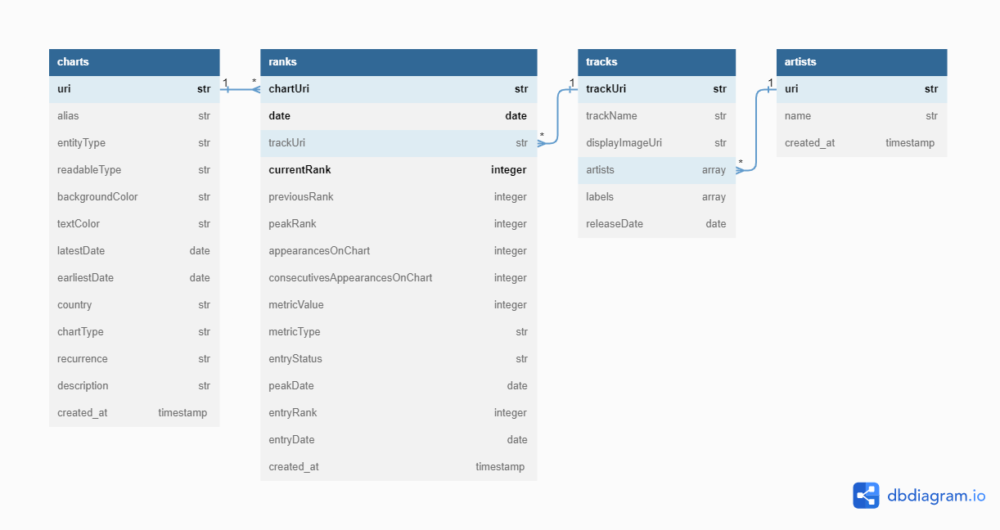

# Spotify Charts Pipeline

Get the daily [Spotify Charts](https://charts.spotify.com/charts/overview/global) data history and load to a PostgreSLQ database



## Set up

1. Register on [Spotify Developer](https://developer.spotify.com/dashboard/)
2. Create an app
3. Add a Redirect URI to the app (e.g. `http://localhost:9000`)
4. Add your CLIENT_ID, SECRET_ID and REDIRECT_URI to the `.env` file

## Running

Create a Poetry virtual environment
````bash
poetry shell
poetry install
````

Instantiate the PostgreSQL docker container
````bash
docker compose -p spotify_charts up -d --build
````

Run the pipeline with the desired arguments
````bash
python src/main.py [from_date] [to_date] [country_code]
````

Example
````bash
python src/main.py --from_date 2023-01-01 --to_date 2023-01-31 --country_code BR
````
## Unit tests
````bash
docker compose -f docker-compose.tests.yml up --build --abort-on-container-exit
````